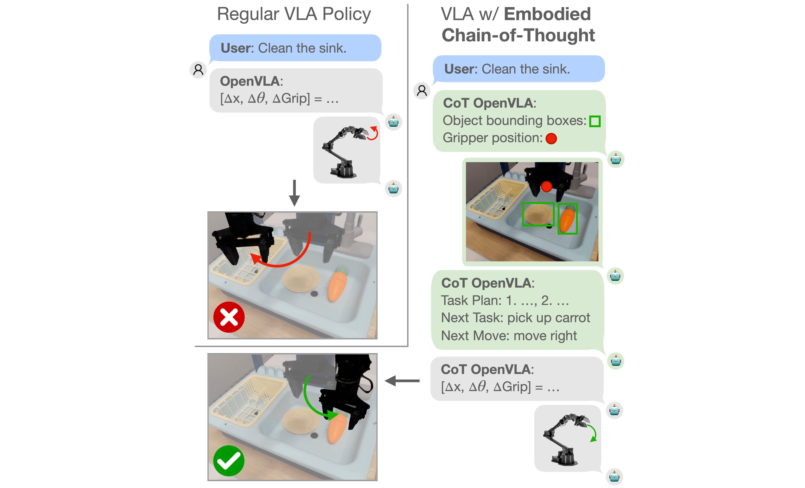

# Robotic Control via Embodied Chain-of-Thought Reasoning

[](https://arxiv.org/pdf/2407.08693)
[](https://colab.research.google.com/drive/1CzRKin3T9dl-4HYBVtuULrIskpVNHoAH?usp=sharing)
[](https://huggingface.co/Embodied-CoT)
[](https://www.python.org)
[](LICENSE)
[](https://embodied-cot.github.io/)

[Michał Zawalski](https://michalzawalski.github.io/), [William Chen](https://verityw.github.io/), [Karl Pertsch](https://kpertsch.github.io/), [Oier Mees](https://www.oiermees.com/),  [Chelsea Finn](https://ai.stanford.edu/~cbfinn/), [Sergey Levine](https://people.eecs.berkeley.edu/~svlevine/)
<hr style="border: 2px solid gray;"></hr>

We present Embodied Chain-of-Thought Reasoning (ECoT): a novel approach for training robotic policies.
We train a vision-language-action model to generate reasoning steps in response to instructions and images before
choosing a robot action, enabling better performance, interpretability, and generalization.

Our codebase is built on top of [OpenVLA](https://github.com/openvla/openvla). We refer to it for the detailed
documentation of the code and dependencies.



## Quickstart

We provide a [Colab notebook](https://colab.research.google.com/drive/1CzRKin3T9dl-4HYBVtuULrIskpVNHoAH?usp=sharing) containing code for loading up our ECoT policy and using it to generate reasoning and actions in response to an observation. Loading the model for inference is easy:
```python
from transformers import AutoModelForVision2Seq, AutoProcessor

device = "cuda"
path_to_hf = "Embodied-CoT/ecot-openvla-7b-bridge"
processor = AutoProcessor.from_pretrained(path_to_hf, trust_remote_code=True)
vla = AutoModelForVision2Seq.from_pretrained(path_to_hf, torch_dtype=torch.bfloat16).to(device)

observation = <ROBOT IMAGE OBSERVATION HERE>
instruction = <YOUR INSTRUCTION HERE>
prompt = "A chat between a curious user and an artificial intelligence assistant. " + \
    "The assistant gives helpful, detailed, and polite answers to the user's questions. " + \
    f"USER: What action should the robot take to {instruction.lower()}? ASSISTANT: TASK:"

inputs = processor(prompt, image).to(device, dtype=torch.bfloat16)
action, generated_ids = vla.predict_action(**inputs, unnorm_key="bridge_orig", max_new_tokens=1024)
generated_text = processor.batch_decode(generated_ids)[0]
```
The standard model in `torch.bfloat16` requires 16 GB of GPU memory, but using [bitsandbytes](https://huggingface.co/docs/bitsandbytes/main/en/index) and 4-bit quantization lowers memory usage to around 5 GB. See the Colab for more details.

## Training and Evaluation

To train the models, from scratch use the following command:

```bash
torchrun --standalone --nnodes 1 --nproc-per-node 8 vla-scripts/train.py  \
  --vla.type "prism-dinosiglip-224px+mx-bridge"  \
  --data_root_dir <path to training data root>  \
  --run_root_dir <path to checkpoint saving directory>  \
  --wandb_project <wandb project name>  \
  --wandb_entity <wandb user name>
```

To evaluate the model on the WidowX robot,

```bash
python3 experiments/bridge/eval_model_in_bridge_env.py
  --model.type prism-dinosiglip-224px+7b
  --pretrained_checkpoint <path to checkpoint>
  --host_ip <robot interface IP>
  --port <robot interface port>
```

Additionally, we provide instructions for [converting, compiling, and evaluating our ECoT VLA with TensorRT-LLM](https://github.com/rail-berkeley/tensorrt-openvla), drastically improving its inference speeds while maintaining performance.

## Dataset of embodied features
The dataset of the embodied features and reasonings is available for download [here](https://huggingface.co/datasets/Embodied-CoT/embodied_features_bridge). During training, it is expected to be found under the `~/.cache/reasonings_dataset.json` path, which is the default location after downloading from Hugging Face. If you want to link the dataset from a different path, update the path [in this line](https://github.com/MichalZawalski/embodied-CoT/blob/6fc10881e1f686947518b2e9aa2f6e8e2b6cccfa/prismatic/vla/datasets/rlds/dataset.py#L60).

## Pretrained models

We release two ECoT models trained as part of our work, and the dataset of reasonings, available [on our
HuggingFace page](https://huggingface.co/Embodied-CoT):
- [`ecot-openvla-7b-bridge`](https://huggingface.co/Embodied-CoT/ecot-openvla-7b-bridge): The main model that we used
for most of our experiments. It was trained on the Bridge dataset annotated with the reasoning for 80k steps.
- [`ecot-openvla-7b-oxe`](https://huggingface.co/Embodied-CoT/ecot-openvla-7b-oxe): A policy that was initially trained
on the Open-X-Embodiment dataset actions, fine-tuned on the mixture of OXE action-only data and our reasonings for
Bridge for another 20k steps.
- [`embodied_features_bridge`](https://huggingface.co/Embodied-CoT/embodied_features_bridge): A dataset of the embodied
features and reasonings collected for Bridge demonstrations.

**Explicit Notes on Model Licensing & Commercial Use**: While all code in this repository is released under an MIT
License, our pretrained models may inherit restrictions from the underlying base models we use. Specifically, both the
above models are derived from Llama-2, and as such are subject to the
[Llama Community License](https://ai.meta.com/llama/license/).

---

## Installation

See the original [OpenVLA](https://github.com/openvla/openvla) repository for detailed installation instructions.

## Repository Structure

High-level overview of repository/project file-tree:

+ `prismatic` - Package source; provides core utilities for model loading, training, data preprocessing, etc.
+ `experiments` - Code for evaluating the policies on a WidowX robot.
+ `vla-scripts/` - Core scripts for training, fine-tuning, and deploying VLAs.
+ `LICENSE` - All code is made available under the MIT License; happy hacking!
+ `Makefile` - Top-level Makefile (by default, supports linting - checking & auto-fix); extend as needed.
+ `pyproject.toml` - Full project configuration details (including dependencies), as well as tool configurations.
+ `README.md` - You are here!

---

#### Citation

If you find our code or models useful in your work, please cite [our paper](https://arxiv.org/pdf/2407.08693):

```bibtex
@article{Zawalski24-ecot,
    title={Robotic Control via Embodied Chain-of-Thought Reasoning},
    author={Michał Zawalski and William Chen and Karl Pertsch and Oier Mees and Chelsea Finn and Sergey Levine},
    journal={arXiv preprint arXiv:2407.08693},
    year={2024}
}
```
